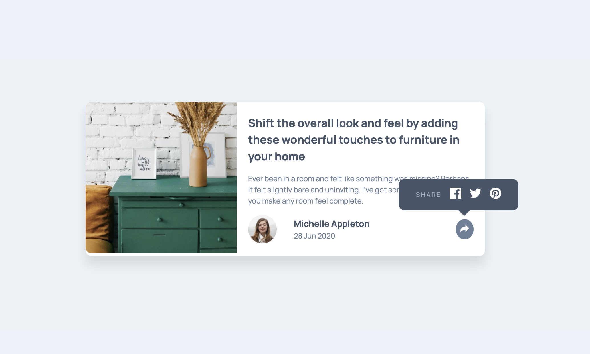
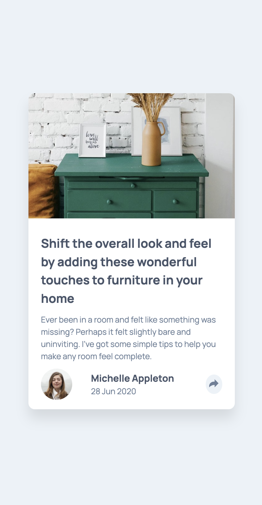

# Frontend Mentor - Article preview component solution

This is a solution to the [Article Preview Component challenge on Frontend Mentor](https://www.frontendmentor.io/challenges/article-preview-component-dYBN_pYFT). Frontend Mentor challenges help you improve your coding skills by building realistic projects.

## Table of contents

- [Overview](#overview)
  - [The challenge](#the-challenge)
  - [Screenshot](#screenshot)
  - [Links](#links)
- [My process](#my-process)
  - [Built with](#built-with)
  - [What I learned](#what-i-learned)
  - [Continued development](#continued-development)
  - [Useful resources](#useful-resources)
- [Author](#author)

## Overview

### The challenge

Users should be able to:

- View the optimal layout for the component depending on their device's screen size.
- See the social media share links when they click the share icon.

### Screenshot





### Links

- Solution URL: [github.com](https://github.com/alepacc/article-preview-component)
- Live Site URL: [live site](https://alepacc.github.io/article-preview-component/)

## My process

### Built with

- Semantic HTML5 markup
- SCSS for styling
- Flexbox for layout
- Mobile-first workflow
- Vanilla JavaScript for interactivity

### What I Learned

This project helped me practice:

- Using `object-fit` and `object-position` for responsive images.
- Managing dropdown visibility with JavaScript and SCSS.
- Creating a mobile-first design and adapting it for larger screens.

Example of JavaScript used:

```javascript
shareButton.addEventListener('click', function (evt) {
    evt.stopPropagation();
    const isOpen = window.getComputedStyle(dropdown).display === 'flex';
    dropdown.style.display = isOpen ? 'none' : 'flex';
    shareContainer.classList.toggle('is-open', !isOpen);
});
```


### Useful Resources

- [MDN Web Docs](https://developer.mozilla.org/) - Comprehensive documentation for web development.
- [CSS Tricks](https://css-tricks.com/) - Great articles and tips for CSS and frontend development.
- [Frontend Mentor](https://www.frontendmentor.io/) - Practice challenges for improving frontend skills.


